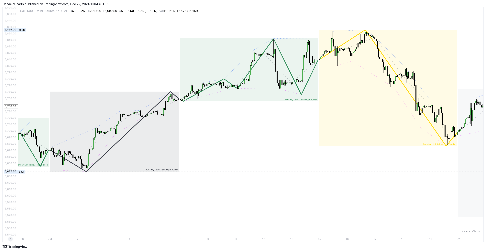

# ICT Missing Weekly Profiles

ICT missing weekly profiles are supplementary profiles designed to fill the gaps left by the standard ICT weekly profiles.&#x20;

These profiles provide additional insights by covering the missing data, helping traders to achieve a more comprehensive understanding of weekly market dynamics.&#x20;

<figure><figcaption></figcaption></figure>

**ICT Missing Weekly Profiles**

* Monday Low Tuesday High Bullish
* Monday High Tuesday Low Bearish&#x20;
* Monday Low Wednesday High Bullish
* Monday High Wednesday Low Bearish
* Monday Low Thursday High Bullish
* Monday High Thursday Low Bearish
* Tuesday Low Wednesday High Bullish
* Tuesday High Wednesday Low Bearish
* Tuesday Low Friday High Bullish
* Tuesday High Friday Low Bearish
* Wednesday Low Thursday High Bullish
* Wednesday High Thursday Low Bearish
* Monday Low Friday High Bullish
* Monday High Friday Low Bearish
* Monday High/Low Range
* Tuesday High/Low Range
* Wednesday High/Low Range
* Thursday High/Low Range
* Friday High/Low Range

By addressing these gaps, ICT missing weekly profiles enhance the overall analysis, enabling traders to identify potential opportunities and refine their market strategies.


ICT Missing Weekly Profiles - [https://pbs.twimg.com/media/GgcH9SVWwAE8gR8?format=jpg\&name=4096x4096](https://pbs.twimg.com/media/GgcH9SVWwAE8gR8?format=jpg\&name=4096x4096)


