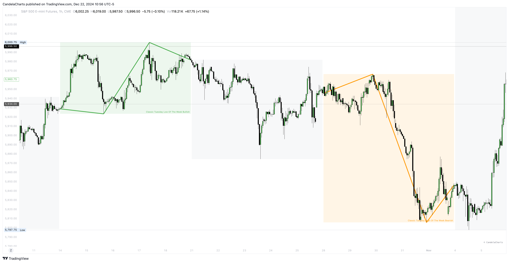

# ICT Weekly Profiles

ICT weekly profiles provide a structured way to analyze how markets typically behave in different phases of the trading week, allowing traders to align their strategies with the observed tendencies.

<figure><figcaption></figcaption></figure>

**ICT Weekly Profiles**

* Classic Tuesday Low Of The Week Bullish&#x20;
* Classic Tuesday High Of The Week Bearish&#x20;
* Wednesday Low Of The Week Bullish&#x20;
* Wednesday High Of The Week Bearish&#x20;
* Consolidation Thursday Reversal Bullish&#x20;
* Consolidation Thursday Reversal Bearish&#x20;
* Consolidation Midweek Rally Bullish&#x20;
* Consolidation Midweek Rally Bearish&#x20;
* Wednesday Weekly Reversal Bullish&#x20;
* Wednesday Weekly Reversal Bearish&#x20;
* Seek And Distroy Bullish Friday&#x20;
* Seek And Distroy Bearish Friday


ICT Weekly Profiles - [https://pbs.twimg.com/media/GgcHYS\_WEAAQ-p8?format=jpg\&name=4096x4096](https://pbs.twimg.com/media/GgcHYS_WEAAQ-p8?format=jpg\&name=4096x4096)


