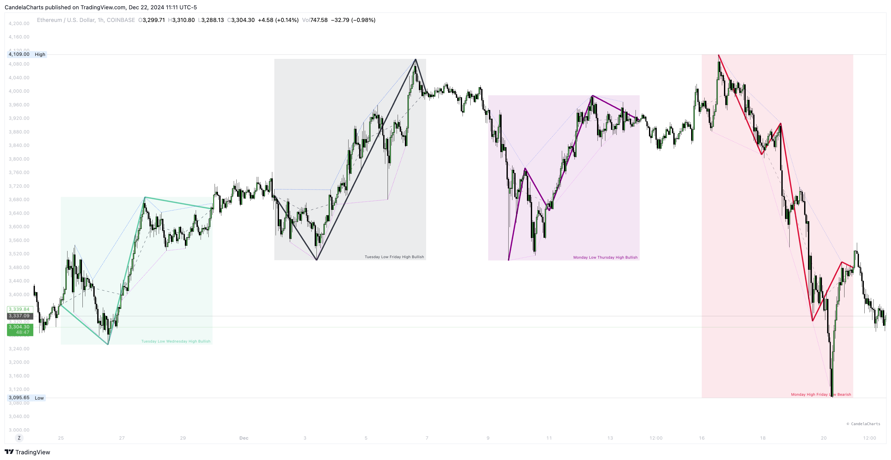

# Overview

ICT (Inner Circle Trader) Weekly Profile templates are analytical frameworks that categorize and describe typical patterns of price action observed during a trading week.&#x20;

<figure><figcaption></figcaption></figure>

These templates are based on recurring market behaviors and are designed to help traders anticipate potential movements in the market by recognizing these patterns.&#x20;
