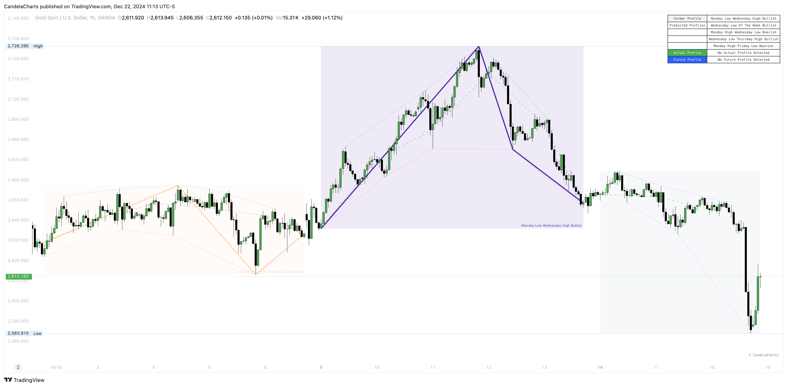

# Scanner

<figure><figcaption></figcaption></figure>

The ICT Weekly Profiles tool offers a comprehensive scanner designed to enhance trading insights by providing the following profile types:

* Former Profile&#x20;
* Predicted Profile
* Actual Profile
* Future Profile

**Former Profile**

This represents the detected profile from the previous week, offering a clear reference point for analyzing past market behavior and identifying recurring patterns.

**Predicted Profile**

A collection of profiles generated through advanced weekly profile detection algorithms, giving traders a forward-looking perspective to anticipate potential market movements.

**Actual Profile**

This is the real-time representation of the current weekly profile, allowing traders to monitor market activity as it unfolds.

**Future Profile**

Leveraging the Markov Chain statistical method, this profile projects future market behavior, offering traders a probabilistic outlook to guide strategic planning.

By combining historical, predictive, real-time, and statistical insights, the ICT Weekly Profiles scanner serves as a powerful tool for comprehensive market analysis and improved trading decisions.
